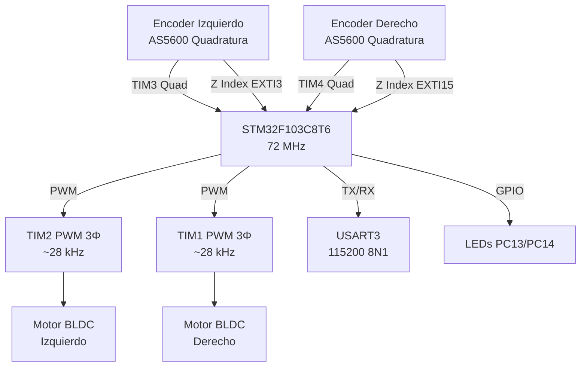

# Hardware

## Microcontrolador

| Característica | Detalle |
|---------------|---------|
| **Modelo** | STM32F103C8T6 (BluePill) |
| **Arquitectura** | ARM Cortex-M3 |
| **Frecuencia** | 72 MHz (HSE 8 MHz × PLL) |
| **Flash** | 64 KiB |
| **RAM** | 20 KiB |
| **Framework** | libopencm3 |
| **Entorno** | PlatformIO |

> **⚠️ Advertencia**: Aunque [`config.h`](../source_code/include/config.h#L7) declara
> `SYSCLK_FREQUENCY_HZ 84000000`, la función [`rcc_clock_setup_in_hse_8mhz_out_72mhz()`](../source_code/src/setup.c#L13)
> configura el SYSCLK a 72 MHz. La constante `CYCLE_COUNTER_PER_MICROSECONDS 84`
> también es incorrecta (debería ser 72). Ver [HW-01](08-known-issues.md#hw-01) para más detalles.

### Periféricos utilizados

| Periférico | Función | Configuración |
|-----------|---------|---------------|
| **TIM1** | PWM 3 fases motor derecho | Prescaler 5, período 512, ~28 kHz |
| **TIM2** | PWM 3 fases motor izquierdo | Prescaler 5, período 512, ~28 kHz |
| **TIM3** | Encoder cuadratura izquierdo | Modo encoder (EM3), 16-bit |
| **TIM4** | Encoder cuadratura derecho | Modo encoder (EM3), 16-bit |
| **SysTick** | Base de tiempos 10 kHz | SysTick a 10 kHz |
| **USART3** | Comunicación serie | 115200 baud, 8N1, RXNE interrupt |
| **EXTI3** | Índice Z encoder izquierdo | Rising edge, GPIOB3 |
| **EXTI15** | Índice Z encoder derecho | Rising edge, GPIOA15 |
| **DWT** | Cycle counter (delay_us) | Habilitado vía `dwt_enable_cycle_counter()` |

---

## Encoders

| Característica | Detalle |
|---------------|---------|
| **Tipo** | Encoder magnético por cuadratura (AS5600 o compatible) |
| **Resolución** | 4096 CPR (cuadratura ×4) |
| **Posición absoluta** | 586 ticks/vuelta eléctrica (múltiples polos magnéticos) |
| **Interfaz** | Quadratura A/B + índice Z (pulso por vuelta) |
| **Timer izquierda** | TIM3 con partial remap (PB4=CH1, PB5=CH2) |
| **Timer derecha** | TIM4 (PB6=CH1, PB7=CH2) |
| **Índice Z izquierda** | PB3 → EXTI3 (rising edge) |
| **Índice Z derecha** | PA15 → EXTI15 (rising edge) |

> **Nota**: El remap parcial de TIM3 (`AFIO_MAPR_TIM3_REMAP_PARTIAL_REMAP`) mueve
> los canales del encoder de PA6/PA7 a PB4/PB5, liberando PA6/PA7 para otros usos
> y agrupando los dos encoders en el puerto GPIOB.

---

## Actuadores / Motores

| Característica | Detalle |
|---------------|---------|
| **Tipo** | BLDC (brushless DC) con imanes permanentes |
| **Cantidad** | 2 |
| **Driver** | 3 half-bridges por motor (TIM1 para derecho, TIM2 para izquierdo) |
| **Control** | Conmutación sinusoidal con realimentación de encoder (FOC simplificado) |
| **RPM máxima** | 900 RPM |
| **Frecuencia PWM** | ~28.125 kHz (72 MHz / 5 / 512) |

---

## Alimentación

| Característica | Detalle |
|---------------|---------|
| **Tensión de entrada** | 7.4 V – 12 V (batería LiPo 2S-3S) |
| **Regulador** | Regulador onboard de la BluePill (3.3V LDO) |
| **Alimentación motores** | Directa de batería a los drivers MOSFET |

---

## PCB

No existe una PCB independiente para OPRcontrolFOC. El circuito de control FOC
se integró directamente en la PCB del robot [UltiBot](https://github.com/OPRobots/UltiBot),
que incorpora:

- La BluePill (STM32F103C8) como controlador
- Drivers MOSFET para 2 BLDC (6 medias pontes)
- Conectores para encoders magnéticos AS5600
- Regulador de alimentación

Los esquemáticos y el layout KiCad están en el repositorio de
[UltiBot](https://github.com/OPRobots/UltiBot). Los directorios `pcb_files/kicad_project/`
y `pcb_files/gerbers/` de este repositorio existen como placeholder y están vacíos.

---

## Pinout Completo

### GPIO

| Pin | Puerto | Modo | Función |
|-----|--------|------|---------|
| **PC13** | GPIOC | Output push-pull | LED onboard — saturación PID motor derecho |
| **PC14** | GPIOC | Output push-pull | LED onboard — saturación PID motor izquierdo |
| **PB14** | GPIOB | Output push-pull | Enable motor izquierdo |
| **PB15** | GPIOB | Output push-pull | Enable motor derecho |
| **PB3** | GPIOB | Input float | Índice Z encoder izquierdo (EXTI3) |
| **PA15** | GPIOA | Input float | Índice Z encoder derecho (EXTI15) |

### PWM — Motor derecho (TIM1)

| Pin | Canal | Función |
|-----|-------|---------|
| **PA8** | TIM1_CH1 | Fase A |
| **PA9** | TIM1_CH2 | Fase B |
| **PA10** | TIM1_CH3 | Fase C |

### PWM — Motor izquierdo (TIM2)

| Pin | Canal | Función |
|-----|-------|---------|
| **PA0** | TIM2_CH1 | Fase A |
| **PA1** | TIM2_CH2 | Fase B |
| **PA2** | TIM2_CH3 | Fase C |

### Encoder cuadratura

| Pin | Timer | Canal | Función |
|-----|-------|-------|---------|
| **PB6** | TIM4_CH1 | A | Encoder derecho — cuadratura A |
| **PB7** | TIM4_CH2 | B | Encoder derecho — cuadratura B |
| **PB4** | TIM3_CH1 | A (remap) | Encoder izquierdo — cuadratura A |
| **PB5** | TIM3_CH2 | B (remap) | Encoder izquierdo — cuadratura B |

### USART3

| Pin | Función |
|-----|---------|
| **PB10** | TX |
| **PB11** | RX (pull-up) |

---

## Prioridades de Interrupción (NVIC)

| IRQ | Prioridad | Función |
|-----|-----------|---------|
| **NVIC_SYSTICK_IRQ** | 16 (grupo 1) | Base de tiempos, lectura de encoders |
| **NVIC_USART3_IRQ** | 32 (grupo 2) | Recepción de comandos serie |
| **NVIC_EXTI3_IRQ** | 48 (grupo 3) | Índice Z encoder izquierdo |
| **NVIC_EXTI15_10_IRQ** | 48 (grupo 3) | Índice Z encoder derecho |

---

## Diagrama de Bloques

---

*Documento generado el 2026-06-30. Ver también [Arquitectura Software](02-software-architecture.md), [Movimiento](04-movement.md), [Encoders](06-encoders-gyro.md).*
