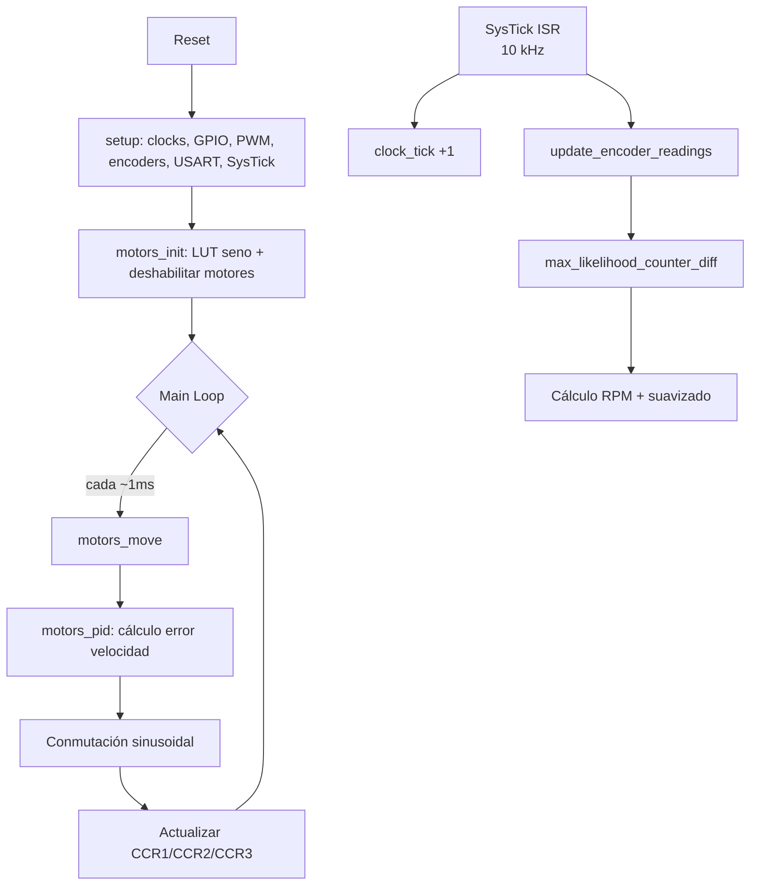

# Arquitectura Software

## Visión General

El firmware de OPRcontrolFOC sigue una arquitectura de **superloop cooperativa
con interrupciones periódicas**. No usa RTOS. La ejecución se divide en dos
niveles de tiempo:

| Nivel | Frecuencia | Disparo | Responsabilidades |
|-------|-----------|---------|-------------------|
| **ISR SysTick** | 10 kHz | Interrupción periódica | Lectura de encoders, base de tiempos |
| **Main loop** | ~1 kHz | Polling de `clock_ticks` | PID de velocidad, conmutación sinusoidal, PWM |

---

## Flujo de Ejecución



---

## Inicialización (`setup.c`)

La función [`setup()`](../source_code/src/setup.c#L198-L206) se ejecuta una sola vez
al arrancar y configura el hardware en este orden:

1. **`setup_clock()`** — HSE 8 MHz → PLL → SYSCLK 72 MHz. Habilita relojes de
   GPIOA/B/C, AFIO, USART3, TIM1/2/3/4. Activa DWT cycle counter.
2. **`setup_gpio()`** — Configura pines: LEDs, enables de motores, PWM (AF push-pull),
   entradas de encoder, USART3. Aplica remap parcial de TIM3.
3. **`setup_usart()`** — USART3 a 115200 8N1, activa interrupción RXNE.
4. **`setup_pwm()`** — TIM1 y TIM2 en modo PWM1 edge-aligned, 3 canales cada uno,
   prescaler 5, período 512 (PWM ≈ 28.125 kHz).
5. **`setup_quadrature_encoders()`** — TIM3 y TIM4 en modo encoder (EM3),
   período 0xFFFF. Configura EXTI3 y EXTI15 para pulsos de índice Z.
6. **`setup_timer_priorities()`** — Asigna prioridades NVIC: SysTick > USART3 > EXTI.
7. **`setup_systick()`** — Configura SysTick a 10 kHz con interrupción habilitada.

Después de `setup()`, [`main()`](../source_code/src/main.c#L18) llama a
[`motors_init()`](../source_code/src/motors.c#L105) que rellena la tabla LUT de
seno, deshabilita los motores e inicializa los índices de fase.

---

## ISR del SysTick

```c
void sys_tick_handler(void) {
  clock_tick();
  update_encoder_readings();
}
```

El handler del SysTick (10 kHz) realiza dos tareas:

1. **`clock_tick()`** — incrementa un contador global `clock_ticks` usado como
   base de tiempos para `delay()` y para el scheduling de `motors_move()`.
2. **`update_encoder_readings()`** — lee los contadores hardware de TIM3/TIM4,
   calcula la diferencia respecto a la lectura anterior usando
   `max_likelihood_counter_diff()`, acumula los ticks totales y calcula la
   velocidad (RPM) con suavizado exponencial de punto fijo.

La llamada a `motors_move()` **está comentada** en el ISR — el control de motores
se ejecuta desde el main loop en su lugar.

> **Nota**: `update_encoder_readings()` se ejecuta a 10 kHz en el ISR, pero
> `motors_move()` se ejecuta a ~1 kHz en el main loop. Esto significa que el
> PID y la conmutación van 10× más lento que la lectura de encoders.

---

## Main Loop

```c
while (1) {
  if (get_clock_ticks() - last_motors_update >= 1) {
    last_motors_update = get_clock_ticks();
    motors_move();
  }
}
```

El main loop es un scheduler simple por polling:

1. Comprueba si ha pasado al menos 1 tick (1 ms) desde la última ejecución.
2. Llama a [`motors_move()`](../source_code/src/motors.c#L147) que ejecuta:
   - `motors_pid()` — cálculo del error y actualización del factor de velocidad
   - Conmutación sinusoidal — cálculo de fases A/B/C y escritura de PWM

No hay sleep ni modos de bajo consumo — el loop corre continuamente (busy-waiting).

---

## Gestión de Interrupciones

### USART3 ISR

```c
void usart3_isr(void) {
  // Acumula caracteres en buffer command[8]
  // Al recibir '\n', parsea y ejecuta manage_command()
}
```

La ISR de USART3 [`usart3_isr()`](../source_code/src/setup.c#L96-L113) recibe
caracteres uno a uno y los acumula en un buffer de 8 bytes. Cuando llega un
salto de línea (`\n`), interpreta el primer carácter como comando y el resto
como valor numérico mediante `atoi()`.

### EXTI ISRs

Las ISRs [`exti3_isr()`](../source_code/src/setup.c#L143-L145) y
[`exti15_10_isr()`](../source_code/src/setup.c#L138-L141) se disparan con el
flanco de subida del pulso de índice Z de cada encoder. Su función es resetear
el contador total de ticks al valor de calibración (offset) correspondiente,
marcando además el motor como inicializado.

---

## Estructura de Archivos

```
source_code/
├── include/
│   ├── command.h        # Gestión de comandos serie
│   ├── commands.h       # Enumeración de comandos (CMD_MOTOR_*)
│   ├── config.h         # Constantes del sistema (frecuencias, PWM)
│   ├── delay.h          # Delays por busy-waiting y base de tiempos
│   ├── encoders.h       # Lectura de encoders y cálculo de velocidad
│   ├── motors.h         # Control de motores (PID + conmutación)
│   ├── setup.h          # Inicialización de hardware
│   ├── usart.h          # Redirección de printf a USART3
│   └── utils.h          # Funciones auxiliares (map, constrain)
└── src/
    ├── main.c           # Punto de entrada y main loop
    ├── command.c        # Implementación de comandos
    ├── delay.c          # Implementación de delays
    ├── encoders.c       # Implementación de lectura de encoders
    ├── motors.c         # Implementación del control de motores
    ├── setup.c          # Implementación de inicialización HW
    ├── usart.c          # Implementación de _write() para printf
    └── utils.c          # Implementación de map/constrain
```

---

*Documento generado el 2026-06-30. Ver también [Hardware](01-hardware.md), [Comunicaciones](03-communications.md), [Control PID](05-control-system.md).*
