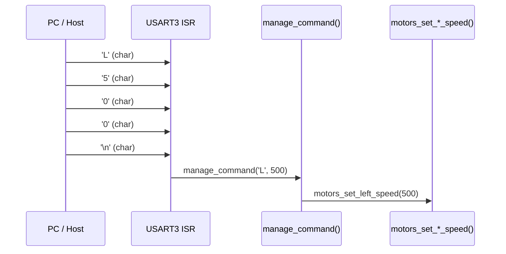

# Comunicaciones

## Interfaz Serie

OPRcontrolFOC expone un protocolo de comandos serie a través de USART3 para
control en tiempo real desde un PC o microcontrolador externo.

### Hardware

| Característica | Detalle |
|---------------|---------|
| **Periférico** | USART3 |
| **Pines** | TX: PB10, RX: PB11 (pull-up) |
| **Baudrate** | 115200 |
| **Formato** | 8 bits de datos, sin paridad, 1 bit de stop (8N1) |
| **Control de flujo** | Ninguno |
| **Recepción** | Interrupción RXNE (carácter por carácter) |

---

## Protocolo de Comandos

El protocolo es textual y minimalista: un carácter de comando seguido de un
valor numérico entero, delimitado por salto de línea (`\n`).

### Formato

```
<CMD><VALOR>\n
```

| Campo | Bytes | Descripción |
|-------|-------|-------------|
| **CMD** | 1 | Carácter ASCII identificando el comando |
| **VALOR** | 1-6 | Valor entero con signo (ej. `500`, `-200`) |
| **DELIM** | 1 | Salto de línea `\n` |

**Ejemplos**:
```
L500\n   → motor izquierdo a 500 RPM
R-200\n  → motor derecho a -200 RPM (invertido)
E\n      → enable motores
D\n      → disable motores
```

### Comandos Disponibles

| Comando | Valor | Función |
|---------|-------|---------|
| **D** | *(ignorado)* | Deshabilitar motores (enable pins a LOW) |
| **E** | *(ignorado)* | Habilitar motores (enable pins a HIGH) |
| **L** | RPM | Establecer velocidad motor izquierdo |
| **R** | RPM | Establecer velocidad motor derecho |

Las velocidades se especifican en RPM. El signo determina el sentido de giro:
- **Positivo**: sentido horario (visto desde el eje)
- **Negativo**: sentido antihorario

---

## Flujo de Recepción



La recepción se realiza carácter por carácter en la ISR de USART3:

1. Cada byte recibido se almacena en `command[i]` y se incrementa `i`.
2. Al recibir `\n`, se interpreta:
   - `command[0]` → comando
   - `&command[1]` → valor numérico (via `atoi()`)
3. Tras procesar, se limpia el buffer y se resetea el índice.

```c
// setup.c:96-113
void usart3_isr(void) {
  static uint8_t i = 0;
  static char command[8];
  // ...
  uint8_t data = usart_recv(USART3);
  if (data != '\n') {
    command[i++] = data;
  } else {
    manage_command(command[0], atoi(&command[1]));
    // limpiar buffer
    i = 0;
  }
}
```

> **⚠️ Advertencia**: El buffer `command[8]` no tiene protección de desbordamiento.
> Un comando de más de 7 caracteres corrompe la pila. Ver [SW-01](08-known-issues.md#sw-01).

---

## Salida Serie (printf)

La función `printf()` se redirige a USART3 mediante la implementación de
[`_write()`](../source_code/src/usart.c#L5-L26), el syscall de newlib utilizado
por `printf()`:

```c
int _write(int file, char *ptr, int len) {
  // Solo stdout, stdin, stderr
  if (file > 2) return -1;
  // Enviar carácter por carácter por USART3 (blocking)
  while (*ptr && (i < len)) {
    usart_send_blocking(USART3, *ptr);
    i++; ptr++;
  }
  return i;
}
```

Actualmente la salida `printf()` está comentada en la mayoría de `motors_move()`,
quedando solo disponible para depuración manual.

---

## Gestión de Errores

El protocolo no implementa checksum, ACK/NACK ni reintentos. Las respuestas de
error están definidas como `TODO` pero no implementadas:

```c
default:
  // TODO: show error on LEDs
  // printf("ERR> %c: %d", command, value);
  break;
```

| Evento | Comportamiento actual |
|--------|----------------------|
| **Comando desconocido** | Silenciosamente ignorado |
| **Buffer desbordado** | Corrupción de pila (no detectado) |
| **Valor no numérico** | `atoi()` devuelve 0 |
| **Error de trama USART** | No se monitoriza (no se leen flags de error) |

---

*Documento generado el 2026-06-30. Ver también [Arquitectura Software](02-software-architecture.md), [Debug](07-debug-system.md).*
