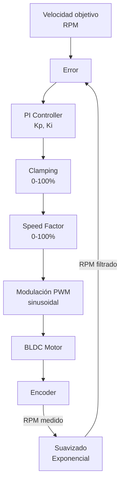

# Control PID

## Arquitectura del Lazo

OPRcontrolFOC implementa un lazo de control **PI de velocidad** independiente
para cada motor. El lazo externo de velocidad actúa directamente sobre el duty
cycle PWM; no hay lazo interno de corriente.



---

## Fórmula PI

El controlador implementa un **PI paralelo** con el término derivativo
comentado (KD=0, no implementado):

$$ u(t) = K_p \cdot e(t) + K_i \int_0^t e(\tau) d\tau $$

En tiempo discreto (sample time $T_s = 1\text{ ms}$):

$$ u[n] = K_p \cdot e[n] + K_i \cdot \sum e[n] $$

```c
motor_left_speed_factor =
    (left_error * MOTOR_SPEED_KP) +
    // ((left_error - motor_left_last_error) * MOTOR_SPEED_KD) +  // COMENTADO
    (motor_left_sum_error * MOTOR_SPEED_KI);
```

---

## Parámetros del Controlador

| Parámetro | Valor | Descripción |
|-----------|-------|-------------|
| **Kp** | 8.0 | Ganancia proporcional |
| **Ki** | 0.1 | Ganancia integral |
| **Kd** | 0.0 | Ganancia derivativa (no implementada) |
| **Frecuencia de control** | ~1 kHz | Período de muestreo $T_s$ |
| **Rango de salida** | 0 – 100 | Speed factor (% de duty cycle) |
| **RPM máxima** | 900 | Velocidad objetivo máxima |

> **Nota**: Los parámetros Kp=8.0 y Ki=0.1 están definidos como macros en
> [`motors.h`](../source_code/include/motors.h#L19-L21). El término derivativo
> (KD) está definido como 0.0 y su cálculo está comentado en el código.
> Ver [CT-01](08-known-issues.md#ct-01).

---

## Cálculo del Error

El error se calcula como la diferencia entre la velocidad objetivo y la
velocidad medida, ambas normalizadas al rango 0-100:

```c
int16_t left_error = abs(motor_left_speed)
    - constrain(map(abs(get_encoder_left_speed()), 0, MOTOR_MAX_RPM, 0, 100), 0, 100);
```

Donde:
- `abs(motor_left_speed)` — velocidad objetivo en valor absoluto (el PID
  no distingue dirección; el sentido lo determina la conmutación)
- `map(abs(encoder_speed), 0, 900, 0, 100)` — velocidad medida mapeada a
  porcentaje (0-100%)
- `constrain(..., 0, 100)` — asegura que la velocidad medida está en rango

---

## Anti-Windup

El controlador implementa **conditional integration** (integración condicional)
como estrategia anti-windup:

```c
if (motor_left_speed_factor < 100 || left_error < 0) {
    motor_left_sum_error += left_error;
    if (motor_left_sum_error < 0) {
        motor_left_sum_error = 0;
    }
}
```

**Condiciones para acumular error integral**:
1. El speed factor no ha saturado (`speed_factor < 100`), **o**
2. El error es negativo (el motor va más rápido de lo pedido — necesita frenar)

**Condiciones para frenar la acumulación**:
- Speed factor = 100% y el error sigue siendo positivo → no acumular
  (el motor ya está al máximo, más integral no ayuda)

**Clamping inferior del integrador**:
- `motor_left_sum_error` nunca baja de 0. No se permite integral negativa.

> **⚠️ Advertencia**: El anti-windup es asimétrico. Cuando `speed_factor == 100`
> y `error > 0`, el integrador deja de acumular (correcto). Pero no hay mecanismo
> de back-calculation para reducir activamente el integrador. Ver
> [CT-02](08-known-issues.md#ct-02).

---

## Indicadores de Saturación

Los LEDs onboard de la BluePill indican saturación del PID:

| LED | Pin | Significado |
|-----|-----|-------------|
| **PC14** | GPIOC14 | Motor izquierdo: speed factor > 95% |
| **PC13** | GPIOC13 | Motor derecho: speed factor > 95% |

```c
if (motor_left_speed_factor > 95) {
    gpio_set(GPIOC, GPIO14);    // LED ON = saturando
} else {
    gpio_clear(GPIOC, GPIO14);  // LED OFF = normal
}
```

Estos LEDs son útiles para diagnosticar visualmente si los motores están
operando al límite de su capacidad.

---

## Respuesta en Frecuencia

Con un sample time de 1 ms ($f_s = 1\text{ kHz}$), el ancho de banda teórico
del lazo de velocidad está limitado por:

$$ f_{BW} \lt \frac{f_s}{10} = 100\text{ Hz} $$

En la práctica, la dinámica del motor y la inercia de la carga limitan el
ancho de banda a unas pocas decenas de Hz.

---

*Documento generado el 2026-06-30. Ver también [Movimiento](04-movement.md), [Encoders](06-encoders-gyro.md), [Debug](07-debug-system.md).*
